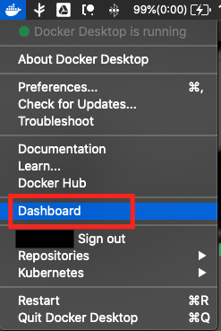
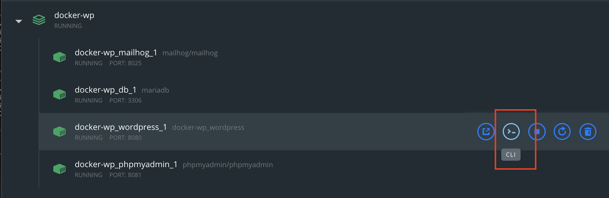
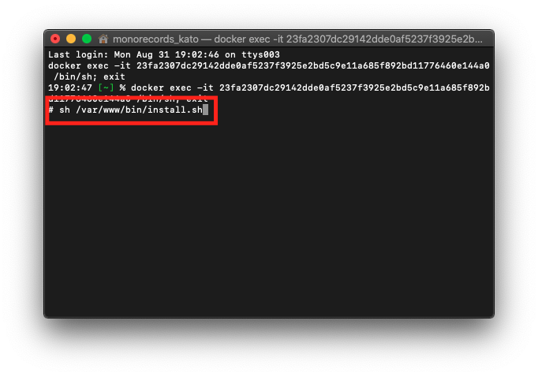

# Wordpress用docker

* テーマファイル郡だけgit管理したいDockerを作る
* テーマディレクトリのみマウントしてgit管理
    * プラグインやコアファイルはgit管理から外してます

## 必要なもの

* `Docker`
    * https://www.docker.com/
    * `Docker Desktop`を推奨
    * インストールが完了しており、`docker version`でバージョン情報が取得出来る状態にあること
* 'Node.js'
    * https://nodejs.org/ja/
    * Nodist(Windows)、nodenv(Mac)推奨
        * https://qiita.com/satoyan419/items/56e0b5f35912b9374305
        * https://qiita.com/alice37th/items/989af6749264de50bb85

## ディレクトリ構造

```
.
├── .data // dockerが利用するDBのデータやログ（自動生成、gitignore対象）
├── .www // wordpressコンテナで生成されたhtdocs配下（自動生成、gitignore対象）
├── bin // シェルファイルの格納
├── docker // Dockerの構成ファイル
│   ├── images
│   └── wordpress
├── my-theme // テーマディレクトリ
│   └── assets // コンパイルされたアセット格納ディレクトリ（自動生成、gitignore対象）
├── node_modules // Nodeパッケージ（自動生成、gitignore対象）
└── src // ソースディレクトリ
    ├── scss // scssソース
    └── webpack // jsソース
```

## 初期設定

* 当リポジトリの内容をcloneまたはダウンロードし、任意のディレクトリに展開
* `cd {{ 作業ディレクトリ }}`
* `docker-compose up -d`
    * CLI上のdockerで`db`が`done`になっても、初期化が終わるまでは正常に表示されないのでしばらく待つ
    * dbコンテナのログに`[Note] mysqld: ready for connections.` が表示されていれば恐らくOK
* `http://localhost:8080/` にアクセス
    * 初期設定画面が出たらそのまま続行
* 初期設定が済んだらdockerのコンテナ内に入る
    * 以下はDocker for Macのキャプチャ
    * 
        * DockerのメニューからDashboardを開く
    * 
        * 起動しているDockerから「***_wordpress」とついているコンテナのCLIボタンを押す
    * 
        * `sh /var/www/bin/install.sh` を実行
        * シェルは`/bin/install.sh`がコピーされているもの
        * `WP-CLI`のインストール、デフォルトプラグインのインストール・有効化、テーマの有効化が行われる

## 初期設定シェルの実行

* プラグインやパーマリンクの設定など、なるべく人の手を介さずに自動化させたい
* WP-CLIをインストールして、出来うる設定はなるべくCLIにやらせる
* WP-CLIはDockerのコンテナ内でインストール・実行している
* シェルファイルはwordpressコンテナにマウントされる
* 以下のプラグインをインストールし、有効化する
    * classic-editor
    * advanced-custom-fields
    * wp-multibyte-patch
* このリポジトリで管理するテーマを有効化する

```bash
#!/usr/bin/env bash

set -ex;
WPINSTALLDIR=/var/www/html

curl -O https://raw.githubusercontent.com/wp-cli/builds/gh-pages/phar/wp-cli.phar

chmod +x wp-cli.phar
mv wp-cli.phar /usr/local/bin/wp

wp plugin install \
    classic-editor advanced-custom-fields wp-multibyte-patch \
    --activate --path=${WPINSTALLDIR} --allow-root

wp theme activate my-theme --path=${WPINSTALLDIR} --allow-root
```

## Node環境の用意

* `npm i`
* 登録済みタスクは下記参照
* 開発サーバは`localhost:8080`を仲介して`localhost:3000`で起動する
    * 3000番が埋まっていた場合は空いているポートを探す
    * php/css/jsを更新すると自動反映・リロード

|タスク名|内容|
|:---|:---|
|`npm start`|アセットのコンパイル・開発サーバの起動|
|`npm run build`|アセットのコンパイルのみ実行|
|`npm run build:production`|Productionモードでアセットのコンパイルを実行|
|`npm run lint:fix`|jsファイルのlint実行・修正を行う|

## Docker構造

|ホスト|コンテナ|詳細・備考|
|:---|:---|:---|
|http://localhost:8080|Wordpress||
|http://localhost:3306|MariaDB||
|http://localhost:8081|PhpMyAdmin||
|http://localhost:8025|MailHog|Wordpressから配信されたメールをインターセプトする|

